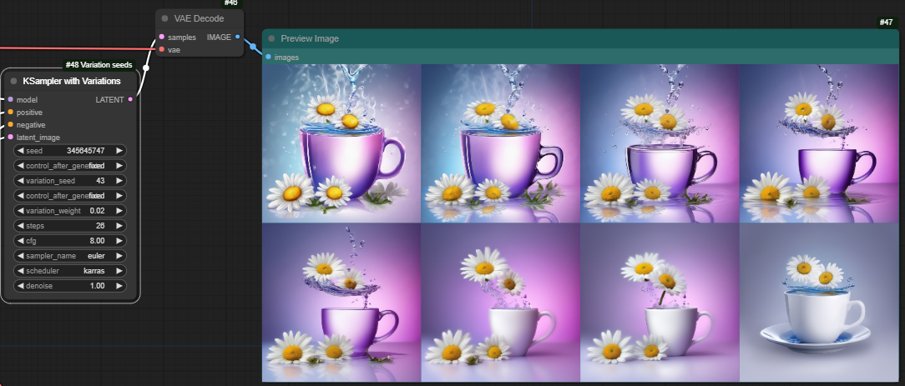
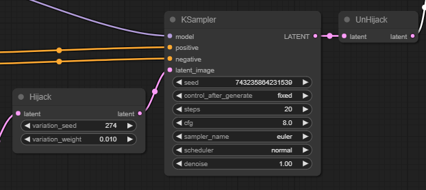

# KSamplers with variation seed (aka Noise Hijack)

[Index of all my custom nodes](https://github.com/chrisgoringe/cg-nodes-index)

Custom nodes that replace `KSampler` and `KSampler Advanced` (and others - see below) and allow you to generate small variations in the initial noise.

Conceptually, `noise = random_based_on(seed)` is replaced with `noise = random_based_on(variation_seed) * x + random_based_on(seed) * (1-x)` for some weight `x`. `x=0` generates an identical image to the normal nodes, small values of `x` generate similar images.

|Original|x=0.1|
|-|-|
|||

## Usage

Once installed, the new nodes are then found under *sampling* as `KSampler with Variations` and `KSampler Advanced with Variations` (for use with other KSamplers, see below). Use them just like you use the original KSampler nodes, with

- `seed` is the seed for the original image
- `control_after_generated` is set to `fixed` by default
- `variation_seed` is the alternative seed
- `variation_weight` is the weight - typically quite small (try 0.1)

## Batch inputs

If the batch size is 1, the node will generate a single image with the specified *variation_weight*.

If the batch size is larger than 1, the node will generate a set of images all based on the same
original noise. The first image will have *variation_weight* of zero, the second will have *variation_weight* as set in the node, the third will have *variation_weight* of 2x the value set in the node, the fourth will have 3x etc..



## Example

|||||
|-|-|-|-|
|x=0|x=0.005|x=0.01|x=0.02|
|||||
|x=0.1|x=0.25|x=0.5|x=1|
|||||

## Installation

Use the [ComfyUI Manager](https://github.com/ltdrdata/ComfyUI-Manager) and search for chrisgoringe or variation.

Manual install:
```
cd [Comfy Install]/custom_nodes
git clone https://github.com/chrisgoringe/cg-noise.git
git clone https://github.com/chrisgoringe/cg-custom-core.git cg_custom_core
```
Then restart ComfyUI and reload the webpage.

## Update

Use the [ComfyUI Manager](https://github.com/ltdrdata/ComfyUI-Manager)

Manual:
```
cd [Comfy Install]/custom_nodes/cg-noise
git pull
cd [Comfy Install]/custom_nodes/cg_custom_core
git pull
```
Then restart ComfyUI and reload the webpage.

## Other KSamplers

The following custom KSamplers are supported out of the box:
- Tiny Terra: 
    - pipeKSampler
    - pipeKSamplerAdvanced
    - pipeKSamplerSDXL (partial support - the refiner step doesn't seem to be reproducable at the moment)

If you use a different KSampler, the following will *probably* work.

There are two custom nodes under noise/hijack. Place the `Hijack` node directly before your KSampler, and the `Unhijack` node directly after it. Set *control_after_generate* to *fixed*. Like this, but with your KSampler:



If this does work, then the KSampler can almost certainly be added to work out of the box. [Raise an issue](https://github.com/chrisgoringe/cg-noise/issues) so I can add it - or just look at `additional_sampler.py` and make the change yourself - PR's welcome! If it doesn't work [raise an issue](https://github.com/chrisgoringe/cg-noise/issues) and I might look at it.

## SDXL Note

If you use the refiner, the noise is added by the first KSampler, so that's where you do the variations. Using the variations node on the second KSampler (where *add_noise* is disabled) doesn't do anything.

## Change Log

### 15 Sept 2023

- Added hijack nodes
- Converted to factory 
- Added Tiny Terra pipe KSampler (not fully functional for pipeKSamplerSDXL)

